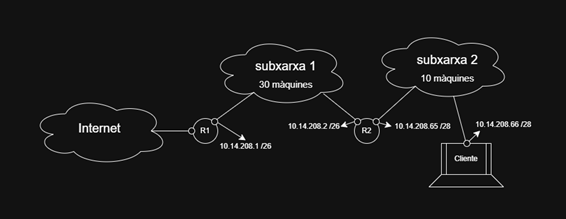

# ICC0001-UF1-PR01: Práctica E-Commerce

**Módulo:** 0369 - Implantación de Sistemas Operativos  
**Ciclo:** Grado Superior ASIX · La Salle Gràcia (25-26)  
**Autor:** Joan Peña Neira  
**Profesor:** Josep Maria Gaya  

---

## Índice

1. [Tabla de Subnetting con cálculos](#1-tabla-de-subnetting-con-cálculos)
2. [Diagrama lógico](#2-diagrama-lógico)
3. [Configuración de Máquinas Virtuales](#3-configuración-de-máquinas-virtuales)
4. [IP Forwarding](#4-ip-forwarding)
5. [Comprobación de conexión](#5-comprobación-de-conexión)

---

## 1. Tabla de Subnetting

Tabla de subnetting según la IP planteada en el ejercicio (`10.14.208.0/21`):

| Máscara | IP Subred | Rango IPs disponibles | IP Broadcast |
|---|---|---|---|
| /26 | 10.14.208.0 | 10.14.208.1 - 10.14.208.62 | 10.14.208.63 |
| /28 | 10.14.208.64 | 10.14.208.65 - 10.14.208.78 | 10.14.208.79 |

> **Nota:** La subred 1 puede parecer en primera instancia que necesita una máscara /27 debido a las 30 máquinas requeridas, pero hay que tener en cuenta las dos IPs extra de las dos interfaces que engloban la subred. Por este motivo, la solución más óptima es un /26 para la subred 1.

---

## 2. Diagrama lógico

Una vez calculado el rango de IPs, es necesario asignarlas a cada una de las interfaces dentro de las subredes:



---

## 3. Configuración de Máquinas Virtuales

El proceso para configurar las IPs, con el fin de poder conectar las máquinas entre sí, consta de varios pasos que hay que replicar en cada una de las máquinas virtuales según las IPs únicas que se quieran asignar.

A continuación se detalla el proceso paso a paso a través de la máquina **Cliente (PC1)**, para entender qué pasos seguir.

Primero hay que dirigirse al directorio `/etc/netplan/` y, una vez dentro, modificar el archivo `01-network-manager-all.yaml`, que permite asignar las IPs, activar o desactivar el protocolo DHCP, etc.

```bash
cd /etc/netplan/
sudo nano 01-network-manager-all.yaml
```

Después, hay que configurar el archivo según las IPs seleccionadas en el diagrama lógico. En este caso, se ha asignado al Cliente la IP `10.14.208.66/28` y su default gateway para acceder al resto es la IP `10.14.208.65`.

### Configuración del archivo `01-network-manager-all.yaml` en la máquina Cliente (PC1)


### Configuración del archivo netplan en la máquina Router2 (PC2)


### Configuración del archivo netplan en la máquina Router1 (PC3)


Una vez realizadas las configuraciones del archivo netplan, hay que aplicarlas ejecutando el siguiente comando:

```bash
sudo netplan try
```

### Comprobación de que netplan se ha aplicado correctamente


---

## 4. IP Forwarding

El **IP Forwarding** es la función de un dispositivo de red (routers, firewalls, etc.) que permite redirigir paquetes de datos IP entre diferentes redes o subredes. Es necesario activarlo para poder crear la conexión entre los distintos dispositivos.

Para activarlo, hay que modificar el contenido del archivo `sysctl.conf` y eliminar el símbolo `#` delante de la línea:

```
net.ipv4.ip_forward=1
```

```bash
sudo nano /etc/sysctl.conf
```

### Modificación del archivo `sysctl.conf`


Para comprobar que se ha aplicado correctamente, se ejecuta el siguiente comando y el output debe ser `net.ipv4.ip_forward = 1`:

```bash
sudo sysctl -p
```


---

## 5. Comprobación de conexión

Finalmente, se realiza un `ping` como comprobación rápida para verificar que las máquinas están correctamente conectadas entre sí, comprobando que los paquetes se envían y son recibidos por el destinatario.

La prueba se ha realizado desde el **Cliente** hacia la IP de PC3, y el resultado ha sido el esperado: todos los paquetes se han recibido sin problemas.

```bash
ping 10.14.208.1
```


Tal como indica el enunciado, se ejecuta también el comando `mtr` para comprobar que la ruta es viable. El resultado muestra la ruta atravesando Router2 (PC2) y llegando finalmente a Router1 (PC3).

### Comando `mtr` con destino a 10.14.208.1 (PC3)

```bash
mtr 10.14.208.1
```


### Comando `mtr` con destino a 10.14.208.65 (comprobación desde PC3 hacia Cliente)


